# FINT Kontroll Device Catalog

FINT Kontroll Device Catalog consumes device catalog entities from Kafka, stores them in PostgreSQL, and republishes the normalized Kontroll views used by FINT Kontroll.

The application is responsible for:

- Kafka consumers for devices, device groups, and device group memberships.
- JPA persistence for the local device catalog.
- Kafka producers for Kontroll device, device group, and membership topics.
- REST endpoints for reading the persisted Kontroll views.
- Swagger/OpenAPI documentation.

## EntityPersistenceService

`EntityPersistenceService` is the main write path for incoming Kafka entities. The Kafka listener configuration passes each consumed `KafkaEntity` to `EntityPersistenceService.handle(...)`, and the service dispatches by entity type:

- `KafkaDevice`
- `KafkaDeviceGroup`
- `KafkaDeviceGroupMembership`

### Entity flow

```mermaid
flowchart LR
    kafkaIn[Kafka input topics] --> consumer[DeviceConsumerConfiguration]
    consumer --> persistence[EntityPersistenceService.handle]

    persistence --> deviceOrGroup[KafkaDevice or KafkaDeviceGroup]
    deviceOrGroup --> mapEntity[EntityMappingService]
    mapEntity --> upsertEntity[DeviceRepository or DeviceGroupRepository]
    upsertEntity --> database[(PostgreSQL device schema)]

    persistence --> membership[KafkaDeviceGroupMembership]
    membership --> lookupRefs[Find Device and DeviceGroup by sourceId]
    lookupRefs --> refsFound{Both found?}
    refsFound -- yes --> mapMembership[EntityMappingService]
    mapMembership --> upsertMembership[DeviceGroupMembershipRepository]
    upsertMembership --> database
    refsFound -- no --> retryBuffer[DeviceGroupMembershipRetryBuffer]
    retryBuffer --> retryScheduler[DeviceGroupMembershipRetryScheduler]
    retryScheduler --> persistence

    database --> kontrollMapper[KontrollEntityMappingService]
    kontrollMapper --> publishers[Kontroll publishing components]
    publishers --> kafkaOut[Kafka Kontroll topics]
```



The main path persists incoming Kafka entities before publishing the corresponding Kontroll entity. Membership events have an extra retry path because they reference both a device and a device group that may arrive on Kafka later.

### Device flow

For `KafkaDevice`, the service:

1. Looks up an existing `Device` by `sourceId`.
2. Maps the Kafka payload onto a new or existing JPA entity with `EntityMappingService`.
3. Saves the `Device` through `DeviceRepository`.
4. Maps the saved entity to `KontrollDevice`.
5. Publishes the Kontroll entity with `KontrollDevicePublishingComponent`.

Devices are upserted by `sourceId`. Partial fields in later events preserve selected existing values according to the mapping logic.

### Device group flow

For `KafkaDeviceGroup`, the service:

1. Looks up an existing `DeviceGroup` by `sourceId`.
2. Maps the Kafka payload onto a new or existing JPA entity.
3. Saves the `DeviceGroup`.
4. Synchronizes the group's member count with `DeviceGroupRepository.syncNoOfMembers(...)`.
5. Maps and publishes the saved group as `KontrollDeviceGroup`.

Device groups are also upserted by `sourceId`.

### Membership flow

For `KafkaDeviceGroupMembership`, the service:

1. Looks up the target `DeviceGroup` by the Kafka membership `deviceGroupId`.
2. Looks up the target `Device` by the Kafka membership `deviceId`.
3. Buffers the membership for retry if either side is missing.
4. Builds the composite membership ID from the persisted group ID and device ID.
5. Upserts the `DeviceGroupMembership`.
6. Publishes `KontrollDeviceGroupMembership`.
7. Republishes the affected `KontrollDeviceGroup` after synchronizing the member count.

Memberships depend on devices and groups already being present locally. If a membership event arrives before its device or group, it is placed in `DeviceGroupMembershipRetryBuffer`. `DeviceGroupMembershipRetryScheduler` drains the buffer every 10 seconds and sends each item back through `EntityPersistenceService.handle(...)`.

## Kafka Topics

The service consumes these resource topics through `DeviceConsumerConfiguration`:

- `device`
- `device-group`
- `device-group-membership`

It publishes normalized Kontroll entities to:

- `kontroll-device`
- `kontroll-device-group`
- `kontroll-device-group-membership`

Topic names are built with the configured Novari/FINT topic prefix parameters, including org ID and domain context.

## REST API

The API is exposed under `/api`:

- `GET /api/devicegroups`
- `GET /api/devicegroups/{id}`
- `GET /api/devices`
- `GET /api/devices/{id}`
- `GET /api/devicegroups/{id}/members`
- `POST /api/devicegroups/publishAllDeviceGroupsDevicesMembership`

The `publishAllDeviceGroupsDevicesMembership` endpoint republishes all persisted device groups, devices, and memberships. It is protected with `@OnlyDevelopers`.

Swagger UI is available at:

```text
http://localhost:<port>/swagger-ui/index.html
```

## Running Locally

The project requires Java 21 and PostgreSQL. The `local-staging` profile expects:

- PostgreSQL
- Kafka service

Run the service with:

```bash
./gradlew bootRun --args='--spring.profiles.active=local-staging'
```

Run tests with:

```bash
./gradlew test
```

## Persistence

Flyway migrations are loaded from:

```text
classpath:db/migration
```
